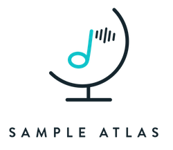

# Description
Sample Atlas is a browser based app that enables the electronic musician to quickly search, navigate, and preview samples for upcoming recording projects. A musicians entire collection of samples is represented as a visual atlas that convey’s the most important information: the information that a musician deems most meaningful to them for finding, previewing and ultimately selecting a sample for a recording.  The current implementation is a barebones proof of concept demonstration for the purpose of quickly testing different visualization approaches.  The sample database was manually constructed and formatted into a JSON file with roughly 20 samples.  There is no ability to add or delete samples from the database and they are limited to the WAV and AIFF file formats, only.   

## Approach
Music samples are represented as a particle simulation of nodes organized into a directed acyclic graph (DAG).  This type of visualization has been used in applications such as [mapping human knowledge](http://www.xdiscovery.com/en/atlas) and [mapping the context and interrelationships](http://www.clojureatlas.com) in the Clojure programming language.  To construct the Sample Atlas, we borrowed from [Level of analysis](http://en.wikipedia.org/wiki/Level_of_analysis) classification to describe the sound in several layers of refinement - Macro, Messo, Micro, & Technical.  This approach has been recommended by [Freesound.org](https://www.freesound.org/help/faq/#sounds-2) to help users create a better description of sounds they have uploaded to the web site.  Currently there are two roots in the atlas - **Type**, which represents an instrument type, and **Mode**, which represents aspects such as how the sound was recorded (e.g., dry) or how it evolves over time.  For search, navigation and listening the musician can quickly explore and ultimately expose branches until they reach a desired sample.  Once the sample is found, the musician clicks on the sample node to begin playing and possibly loop until she clicks the sample again, or clicks another node to begin exploring other parts of the graph.

## Current Status
- [Version 0.0.1](https://floating-anchorage-3021.herokuapp.com) deployed on Heroku. (May 2015) 

## Future Work
- Allow the graph to provide visual cues for each layer.  For example, the Macro and Micro layers might include avatars of the sampled instrument.
- Add information about the sample, including its file format, and location on the musician hard drive will be presented as well.
- Provide a project sheet that the user can fill out and store for each project.  The sheet will contain the samples that have been selected for the project, and the ability to preview them directly from the sheet.
- Connect to an API (e.g., [Freesound.org](https://www.freesound.org)) to enable the musician to explore and add new samples to the Sample Atlas
- Add a search bar to quickly search for a sample by name

## Credits
- [Arbor.js](http://arborjs.org) - Particle System
- [Hana Kelley](http://hanakelley.com/) - Visual Design (Logo, Color Scheme)